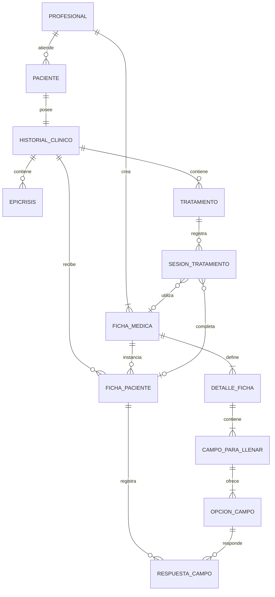

# Servicio de historiales clínicos

Sistema para administrar pacientes y sus historias clínicas. El alcance funcional se concentra exclusivamente en pacientes, epicrisis, fichas médicas y tratamientos. La autenticación y administración de profesionales pertenecen al futuro microservicio de usuarios; este servicio conserva la responsabilidad de autorizar la propiedad de cada recurso.

> La integración JWT, la separación de responsabilidades y el procedimiento de rectificación/auditoría se documentan en [docs/INTEGRACION_USUARIOS_Y_RECTIFICACIONES.md](docs/INTEGRACION_USUARIOS_Y_RECTIFICACIONES.md).

> **Importante:** la ausencia de autenticación es una decisión de alcance para esta etapa. El sistema no debe publicarse ni utilizar datos clínicos reales en estas condiciones.

## Estado del proyecto

El microservicio y el frontend cuentan con módulos funcionales de plantillas de ficha médica, pacientes, epicrisis y tratamientos. Se encuentran implementados el alta de tratamientos, la carga opcional de su primera sesión y la continuación de tratamientos pendientes. Eureka y Gateway todavía no fueron generados.

## Arquitectura prevista

```text
React (JavaScript + JSX, Vite)
               |
               | HTTP/REST + JSON
               v
      Spring Cloud Gateway
               |
               | descubrimiento de servicio
               v
  clinical-history-service <----> PostgreSQL
               |
               v
          Eureka Server
```

- `frontend`: interfaz web construida con React, JavaScript, JSX y Vite.
- `api-gateway`: único punto de entrada previsto para el frontend.
- `eureka-server`: registro y descubrimiento de servicios.
- `clinical-history-service`: microservicio que contiene toda la lógica de negocio.
- PostgreSQL: persistencia relacional del dominio clínico.
- Docker Compose: ejecución coordinada del sistema completo.

## Estructura del repositorio

```text
Servicio-historiales-clinicos/
|-- api-gateway/
|-- clinical-history-service/
|-- docs/
|-- eureka-server/
|-- frontend/
|-- .env.example
|-- .gitignore
|-- compose.yaml
`-- README.md
```

Los directorios contienen inicialmente archivos `.gitkeep` y se completarán cuando se genere cada proyecto.

## Tecnologías acordadas

### Backend e infraestructura

- Java 21
- Spring Boot 3.5.x
- Maven
- Spring Web
- Spring Data JPA
- Bean Validation
- Spring Cloud Gateway
- Spring Cloud Netflix Eureka
- PostgreSQL
- Flyway
- OpenAPI/Swagger
- Docker y Docker Compose

### Frontend

- React
- JavaScript
- JSX
- Vite como servidor de desarrollo y herramienta de compilación

El frontend incluye actualmente:

- Página principal con acceso a los módulos previstos.
- Módulo de fichas médicas habilitado.
- Módulo de pacientes habilitado, con alta, consulta, edición, eliminación y asignación de fichas.
- Módulo de epicrisis habilitado, con ficha de seguimiento opcional.
- Módulo de tratamientos habilitado, con alta, primera sesión opcional y continuación de tratamientos pendientes.
- Módulo de exportación de historia clínica completa en PDF, Word (DOCX), CSV y XLSX, con motivo, hash SHA-256 y trazabilidad.
- Selección temporal del profesional mediante su identificador.
- Listado de plantillas del profesional.
- Creación y edición de detalles, campos y opciones anidadas.
- Eliminación de plantillas con confirmación.
- Visualización de errores devueltos por el backend.
- Diseño adaptable a escritorio y dispositivos móviles.
- Vista clínica compacta y adaptable tanto para previsualizar plantillas como para consultar las fichas completadas de un paciente.
- El formulario para completar fichas durante el registro de un paciente utiliza la misma distribución clínica adaptable, conservando controles interactivos.
- Al editar un paciente se muestran todas sus fichas asignadas y se pueden actualizar sus respuestas junto con los datos personales.
- El editor de plantillas presenta la creación y modificación como una hoja clínica, con encabezado, secciones y campos configurables.
- El teléfono del paciente es opcional; cuando se informa, solo admite dígitos tanto al registrar como al editar.

Durante el desarrollo, Vite redirige las solicitudes `/api` hacia `http://localhost:8080`. Esto permite probar el microservicio directamente hasta incorporar el API Gateway.

## Modelo de dominio

El modelo inicial fue aportado mediante un diagrama y se refinó durante la implementación. Las secciones siguientes distinguen las decisiones ya implementadas de las que continúan pendientes.



### Paciente

Representa a la persona cuya información clínica administra el sistema.

| Campo | Tipo propuesto |
|---|---|
| `id_paciente` | entero |
| `id_profesional` | entero; referencia externa |
| `nombre` | texto |
| `apellido` | texto |
| `dni` | texto |
| `telefono` | texto |
| `fechaNacimiento` | fecha |
| `sexo` | texto |

### Historial clínico

Es el agregado conceptual de la información clínica perteneciente a un paciente. Actualmente no se persiste como una tabla o entidad separada: fichas completadas, epicrisis y tratamientos se relacionan directamente con `Paciente`.

### Epicrisis

Registra una síntesis clínica asociada al historial.

| Campo | Tipo propuesto |
|---|---|
| `id_epicrisis` | entero |
| `fecha_hora` | fecha y hora |
| `observaciones` | texto |
| `id_ficha_seguimiento` | entero opcional; referencia a una plantilla del profesional |
| `id_ficha_paciente_seguimiento` | entero opcional; referencia a la instancia completada para el paciente |

La implementación relaciona directamente cada epicrisis con un paciente. La fecha y hora se generan automáticamente al registrar y se almacenan en UTC.

#### Flujo de registro

1. El profesional abre el módulo `Epicrisis` e ingresa apellido o nombre desde la pantalla inicial.
2. El sistema lista todos los pacientes del profesional que coinciden con la búsqueda.
3. El profesional selecciona un único paciente y confirma la selección.
4. El sistema abre la pantalla de registro, mostrando apellido, nombre y DNI.
5. Desde esa pantalla se pueden consultar todos los datos del paciente y sus fichas médicas, regresando después al registro.
6. Opcionalmente, presiona `Agregar ficha de seguimiento`, selecciona una ficha médica del profesional en la ventana emergente y confirma con `Agregar`.
7. La ficha seleccionada aparece completa en la pantalla y el profesional carga los datos del paciente en sus campos.
8. El profesional escribe las observaciones clínicas, con un máximo de 1000 caracteres.
9. Presiona `Registrar epicrisis` y confirma explícitamente el guardado.
10. Solo después de confirmar se envía el registro al backend.
11. Cuando el registro finaliza correctamente, el sistema muestra una pantalla de éxito con la opción `Volver al panel principal`.

#### API de epicrisis

| Método | Ruta | Operación |
|---|---|---|
| `POST` | `/api/v1/profesionales/{idProfesional}/pacientes/{idPaciente}/epicrisis` | Registrar una epicrisis |
| `GET` | `/api/v1/profesionales/{idProfesional}/pacientes/{idPaciente}/epicrisis` | Listar las epicrisis del paciente |

Reglas aplicadas:

- El paciente debe pertenecer al profesional indicado en la ruta.
- Las observaciones son obligatorias y no pueden superar 1000 caracteres.
- La fecha y hora del registro son generadas por el backend.
- La ficha de seguimiento es opcional; si se informa, debe ser una ficha médica perteneciente al mismo profesional.
- Si se selecciona una ficha, deben enviarse todas sus respuestas. El backend valida campos `SI/NO`, selección simple, selección múltiple y grupos excluyentes.
- La ficha completada queda incorporada a las fichas del paciente y vinculada a la epicrisis que originó el seguimiento.
- Una epicrisis puede asociar como máximo una ficha médica de seguimiento.
- Un paciente puede tener cero o más epicrisis.

### FichaMedica

Representa una **plantilla configurable** creada por un profesional. Un profesional puede tener entre cero y cinco fichas médicas. Una misma plantilla puede asignarse a distintos pacientes sin compartir entre ellos las respuestas cargadas.

| Campo | Tipo propuesto |
|---|---|
| `id_ficha_medica` | entero |
| `id_profesional` | entero; referencia externa |
| `nombre_ficha` | texto |
| `fecha_hora_creacion` | fecha y hora |
| `observaciones` | texto |

### DetalleFicha

Define una sección perteneciente a la plantilla, por ejemplo `Antecedentes personales no patológicos`.

| Campo | Tipo propuesto |
|---|---|
| `titulo` | texto |
| `descripcion` | texto opcional |
| `orden` | entero |

### CampoParaLlenar

Define una pregunta o concepto que deberá completarse dentro del detalle, por ejemplo `Tabaquismo`. Debe contener una o más opciones.

| Campo | Tipo propuesto |
|---|---|
| `titulo` | texto |
| `descripcion` | texto opcional |
| `orden` | entero |

### OpcionCampo

Define una alternativa seleccionable o un dato que se completa por teclado. Cada `CampoParaLlenar` debe contener entre una y muchas opciones.

| Campo | Tipo propuesto |
|---|---|
| `titulo` | texto |
| `tipo` | `SELECCION` o `ENTRADA` |
| `descripcion` | texto opcional |
| `orden` | entero |
| `grupo_exclusion` | texto opcional |

El `grupo_exclusion` permite indicar que varias opciones son disyuntivas. Si el profesional selecciona una opción del grupo, las demás quedan desmarcadas.

Las opciones de tipo `SELECCION` se presentan como casillas también cuando el campo admite una sola selección. Al marcar una opción se desmarcan las demás según las reglas del campo, y al volver a pulsar la misma opción se puede dejar el campo sin selección.

### FichaPaciente

Representa la asignación de una plantilla de ficha médica al historial clínico de un paciente. Su existencia separa la definición reutilizable de la información clínica efectivamente completada.

Cada instancia registra su origen:

- `DIRECTA`: ficha asociada desde el alta o la edición del paciente. Se muestra al consultar y editar sus datos.
- `EPICRISIS`: ficha completada como seguimiento de una epicrisis. Se conserva para el contexto de la epicrisis y no se muestra en la consulta general del paciente.
- `TRATAMIENTO`: ficha completada dentro de una sesión de tratamiento. Se conserva vinculada a esa sesión y no se muestra en la consulta general del paciente.

La consulta general de pacientes tampoco incorpora la lista de epicrisis. El módulo de pacientes devuelve únicamente datos personales y fichas de origen `DIRECTA`.

### RespuestaCampo

Conserva la respuesta correspondiente a una `OpcionCampo` dentro de una `FichaPaciente`. Según el tipo de opción, registra una selección o un valor ingresado por teclado. Las respuestas pertenecen exclusivamente al paciente al que se asignó la ficha.

## Lógica de construcción y uso de fichas médicas

### Creación de la plantilla

1. El profesional crea una ficha médica y define su nombre.
2. Agrega una o más secciones representadas por `DetalleFicha`.
3. Dentro de cada sección agrega uno o más `CampoParaLlenar`.
4. Dentro de cada campo agrega obligatoriamente una o más `OpcionCampo`.
5. Las opciones se ordenan para determinar cómo se mostrarán en el frontend.
6. El profesional puede no tener plantillas y crear como máximo cinco fichas médicas.

### Asignación y carga

1. Se selecciona una plantilla perteneciente al mismo profesional que tiene asociado el paciente.
2. La plantilla se asigna al historial clínico y genera una `FichaPaciente`.
3. El profesional completa o selecciona las opciones correspondientes.
4. Las respuestas se guardan en la ficha del paciente y no modifican la plantilla.
5. Una misma plantilla puede utilizarse con muchos pacientes, manteniendo respuestas independientes.

### Edición de respuestas del paciente

1. Al editar al paciente, el sistema identifica cada `FichaPaciente` por su propio ID y recupera la plantilla que define sus campos.
2. Se muestran los valores previamente guardados y se permite modificarlos con los mismos controles usados durante la carga inicial.
3. El profesional puede agregar una nueva instancia desde las plantillas disponibles, editar las fichas existentes o eliminar una ficha asociada.
4. Cada ficha existente se identifica mediante `idFichaPaciente`; las fichas nuevas omiten ese identificador y se crean durante la actualización.
5. El backend vuelve a validar campos `SI/NO`, selección simple, selección múltiple y grupos excluyentes.
6. Las altas, modificaciones, eliminaciones y los datos personales se actualizan dentro de una única transacción.
7. Si se elimina una ficha que nació como seguimiento de una epicrisis, la epicrisis se conserva y se libera únicamente la referencia a la instancia completada.

### Ejemplo

```text
Antecedentes personales no patológicos     DetalleFicha
`-- Tabaquismo                             CampoParaLlenar
    |-- Sí                                 OpcionCampo: SELECCION
    |-- No                                 OpcionCampo: SELECCION
    `-- ¿Cuántos por día?                  OpcionCampo: ENTRADA
```

Las opciones `Sí` y `No` pertenecen al mismo grupo de exclusión, por lo que son disyuntivas. `¿Cuántos por día?` permite ingresar un valor por teclado. La futura implementación podrá condicionar la habilitación de esta última opción a que se seleccione `Sí`.

### Reglas de negocio confirmadas

- Cada profesional puede tener entre cero y cinco plantillas de ficha médica.
- Cada plantilla pertenece a un único profesional.
- Cada plantilla contiene uno o más detalles.
- Cada detalle contiene uno o más campos para llenar.
- Cada campo para llenar contiene obligatoriamente una o más opciones.
- Una opción puede ser seleccionable o permitir entrada por teclado.
- Las opciones seleccionables pueden agruparse para comportarse de forma disyuntiva.
- Asignar una plantilla a un paciente no altera la plantilla original.
- Las respuestas de pacientes diferentes nunca se comparten.

### Tratamiento

Registra un plan clínico perteneciente directamente a un paciente. La implementación utiliza la entidad `Tratamiento` y persiste tanto la cantidad total como la cantidad de sesiones faltantes.

| Campo | Tipo implementado | Regla |
|---|---|---|
| `id` | entero largo | Identificador generado |
| `id_paciente` | entero largo | Paciente propietario |
| `nombre` | texto de hasta 150 caracteres | Obligatorio |
| `descripcion` | texto de hasta 1000 caracteres | Opcional |
| `cantidad_sesiones_total` | entero | Entre 1 y 1000 |
| `cantidad_sesiones_faltantes` | entero | Entre cero y el total |
| `fecha_creacion` | fecha y hora UTC | Generada automáticamente |

`cantidad_sesiones_faltantes` se inicializa con el total y se decrementa atómicamente al registrar cada sesión. Si el alta incluye la primera sesión, el tratamiento nace con una sesión menos pendiente. Cuando llega a cero, se considera terminado y deja de aparecer en el listado de tratamientos pendientes.

### SesionTratamiento

Representa cada atención, avance o sesión registrada dentro de un tratamiento. Sustituye el nombre conceptual inicial `DetalleTratamiento` por un nombre que refleja mejor su función.

| Campo | Tipo implementado | Regla |
|---|---|---|
| `id` | entero largo | Identificador generado |
| `id_tratamiento` | entero largo | Tratamiento propietario |
| `nro_sesion` | entero | Correlativo, comienza en 1 y es único dentro del tratamiento |
| `observaciones` | texto de hasta 1000 caracteres | Obligatorio |
| `fecha_hora` | fecha y hora UTC | Generada automáticamente |
| `id_ficha_seguimiento` | entero largo | Plantilla médica opcional |
| `id_ficha_paciente_seguimiento` | entero largo | Instancia completada opcional |

Cada sesión puede utilizar como máximo una plantilla de ficha médica perteneciente al mismo profesional. Cuando se selecciona una plantilla, se crea una `FichaPaciente` de origen `TRATAMIENTO`, se guardan todas sus respuestas y se vincula la instancia completada a la sesión. La ficha se persiste antes que la sesión para garantizar la integridad referencial también al continuar un tratamiento ya existente.

### Flujo funcional de tratamientos

1. El profesional abre `Tratamientos`, busca al paciente por apellido o nombre, lo selecciona y confirma la selección.
2. El sistema permite consultar los datos completos del paciente o elegir entre `Asignar nuevo tratamiento` y `Continuar un tratamiento`.
3. Para un tratamiento nuevo se ingresan nombre, descripción opcional y cantidad total de sesiones.
4. Opcionalmente se habilita `Cargar la primera sesión ahora`.
5. Al cargar una sesión, primero se ofrece asociar una ficha médica. Si se selecciona, sus campos se completan en pantalla.
6. Después de la ficha se ingresan las observaciones obligatorias de la sesión.
7. El alta completa —tratamiento, primera sesión, ficha y respuestas— se ejecuta en una única transacción.
8. Para continuar, el sistema consulta y muestra únicamente tratamientos con sesiones faltantes mayores que cero.
9. Cada opción muestra el nombre, la cantidad de sesiones realizadas, el total y las pendientes.
10. El profesional selecciona un tratamiento y presiona `Continuar tratamiento`.
11. La pantalla indica el próximo número de sesión; primero permite cargar la ficha opcional y luego solicita las observaciones.
12. `Cancelar registro` pide confirmación antes de descartar los datos. `Confirmar registro` también pide confirmación antes de enviar la sesión.
13. El backend bloquea el tratamiento durante el registro para impedir que solicitudes simultáneas excedan el total planificado.
14. Al completar la última sesión, el tratamiento queda terminado automáticamente.

## Relaciones interpretadas

- Un profesional puede tener asociados cero o más pacientes.
- Cada paciente pertenece a un profesional, identificado mediante `id_profesional`.
- Un paciente posee un historial clínico.
- Un historial clínico puede contener cero o más epicrisis.
- Un profesional puede crear entre cero y cinco plantillas de ficha médica.
- Un historial clínico puede recibir cero o más fichas basadas en esas plantillas.
- Un historial clínico puede contener cero o más tratamientos.
- Una plantilla de ficha médica contiene uno o más detalles.
- Un detalle de ficha contiene uno o más campos para llenar.
- Un campo para llenar contiene una o más opciones.
- Un tratamiento contiene cero o más sesiones; puede crearse sin cargar la primera.

## Decisiones pendientes del dominio

- Determinar si los identificadores serán enteros o UUID.
- Definir el mecanismo futuro para validar `id_profesional`; por ahora se conservará en `Paciente` como referencia externa simple porque este sistema no administra profesionales.
- Precisar cómo se representarán los valores de entrada, inicialmente texto, y si se agregarán tipos como número o fecha.
- Definir si una opción de entrada puede depender formalmente de otra opción, como `¿Cuántos por día?` respecto de `Sí`.
- Definir qué ocurre con las fichas ya asignadas cuando el profesional modifica su plantilla.
- Definir reglas de edición, anulación y conservación de los registros clínicos.

## Convenciones iniciales

- API versionada bajo `/api/v1`.
- Intercambio de información mediante JSON.
- Fechas y horas de backend almacenadas en UTC.
- DTOs separados de las entidades de persistencia.
- Migraciones de base de datos administradas con Flyway.
- El borrado físico de pacientes está deshabilitado para preservar epicrisis, tratamientos, sesiones y auditorías. Una futura baja deberá implementarse como inactivación lógica.
- La arquitectura objetivo hará que el frontend se comunique con el API Gateway. Mientras Gateway no exista, Vite y el contenedor web redirigen `/api` directamente al microservicio.

### División de responsabilidades del backend

Cada módulo funcional se organiza con los siguientes paquetes:

```text
fichamedica/
|-- controlador/  endpoints REST; en el futuro extraerá la identidad del JWT
|-- servicio/     lógica de negocio, mapeo y límites transaccionales
|-- repositorio/  acceso a PostgreSQL mediante Spring Data JPA
|-- modelo/       entidades y enumeraciones persistentes
`-- dto/         cuerpos de entrada y salida de la API

excepcion/       errores de negocio y tratamiento centralizado
```

Los controladores existentes conservan temporalmente `idProfesional` en la ruta. En modo `jwt`, el servicio obtiene la identidad de los claims firmados y exige que coincida con la ruta; en modo `local` se mantiene compatibilidad de desarrollo. La exportación nueva no acepta ese identificador: siempre lo resuelve desde la identidad autenticada. Véanse [la guía de integración](docs/INTEGRACION_USUARIOS_Y_RECTIFICACIONES.md) y [la documentación de exportación](docs/EXPORTACION_HISTORIA_CLINICA.md).

## Índice de endpoints del servicio

La URL local del microservicio es `http://localhost:8080`. Los endpoints funcionales se agrupan por recurso:

| Recurso | Método | Ruta |
|---|---|---|
| Fichas médicas | `POST` | `/api/v1/profesionales/{idProfesional}/fichas-medicas` |
| Fichas médicas | `GET` | `/api/v1/profesionales/{idProfesional}/fichas-medicas` |
| Fichas médicas | `GET` | `/api/v1/profesionales/{idProfesional}/fichas-medicas/{idFicha}` |
| Fichas médicas | `PUT` | `/api/v1/profesionales/{idProfesional}/fichas-medicas/{idFicha}` |
| Fichas médicas | `DELETE` | `/api/v1/profesionales/{idProfesional}/fichas-medicas/{idFicha}` |
| Pacientes | `POST` | `/api/v1/profesionales/{idProfesional}/pacientes` |
| Pacientes | `GET` | `/api/v1/profesionales/{idProfesional}/pacientes` |
| Pacientes | `GET` | `/api/v1/profesionales/{idProfesional}/pacientes/{idPaciente}` |
| Pacientes | `PUT` | `/api/v1/profesionales/{idProfesional}/pacientes/{idPaciente}` |
| Pacientes | `DELETE` | `/api/v1/profesionales/{idProfesional}/pacientes/{idPaciente}` |
| Epicrisis | `POST` | `/api/v1/profesionales/{idProfesional}/pacientes/{idPaciente}/epicrisis` |
| Epicrisis | `GET` | `/api/v1/profesionales/{idProfesional}/pacientes/{idPaciente}/epicrisis` |
| Tratamientos | `POST` | `/api/v1/profesionales/{idProfesional}/pacientes/{idPaciente}/tratamientos` |
| Tratamientos | `GET` | `/api/v1/profesionales/{idProfesional}/pacientes/{idPaciente}/tratamientos` |
| Tratamientos | `GET` | `/api/v1/profesionales/{idProfesional}/pacientes/{idPaciente}/tratamientos/sin-terminar` |
| Tratamientos | `POST` | `/api/v1/profesionales/{idProfesional}/pacientes/{idPaciente}/tratamientos/{idTratamiento}/sesiones` |
| Epicrisis | `POST` | `/api/v1/profesionales/{idProfesional}/pacientes/{idPaciente}/epicrisis/{idEpicrisis}/rectificaciones` |
| Epicrisis | `GET` | `/api/v1/profesionales/{idProfesional}/pacientes/{idPaciente}/epicrisis/{idEpicrisis}/auditoria` |
| Epicrisis | `GET` | `/api/v1/profesionales/{idProfesional}/pacientes/{idPaciente}/epicrisis/{idEpicrisis}/informe-auditoria` |
| Tratamientos | `POST` | `/api/v1/profesionales/{idProfesional}/pacientes/{idPaciente}/tratamientos/{idTratamiento}/rectificaciones` |
| Sesiones | `POST` | `/api/v1/profesionales/{idProfesional}/pacientes/{idPaciente}/tratamientos/{idTratamiento}/sesiones/{idSesion}/rectificaciones` |
| Tratamientos/sesiones | `GET` | Los mismos recursos terminados en `/auditoria` o `/informe-auditoria` |
| Exportación | `GET` | `/api/pacientes` (pacientes del profesional autenticado) |
| Exportación | `POST` | `/api/pacientes/{pacienteId}/historia-clinica/exportar` |

Además, Spring Boot Actuator y Springdoc exponen endpoints operativos:

| Método | Ruta | Descripción |
|---|---|---|
| `GET` | `/actuator/health` | Estado general y sondas de salud del servicio |
| `GET` | `/actuator/info` | Información pública configurada del servicio |
| `GET` | `/v3/api-docs` | Especificación OpenAPI en JSON |
| `GET` | `/swagger-ui.html` | Interfaz web interactiva de Swagger |

Las rutas de Actuator pueden incluir enlaces y subrutas generadas por Spring. Solamente `health` e `info` están habilitados para exposición externa en la configuración actual.

## API de plantillas de ficha médica

El profesional se representa mediante un identificador externo incluido en la URL. Crear o actualizar una ficha procesa el agregado completo: plantilla, detalles, campos y opciones.

| Método | Ruta | Operación | Respuesta exitosa |
|---|---|---|---|
| `POST` | `/api/v1/profesionales/{idProfesional}/fichas-medicas` | Crear una plantilla | `201 Created` |
| `GET` | `/api/v1/profesionales/{idProfesional}/fichas-medicas` | Listar las plantillas del profesional | `200 OK` |
| `GET` | `/api/v1/profesionales/{idProfesional}/fichas-medicas/{idFicha}` | Consultar una plantilla | `200 OK` |
| `PUT` | `/api/v1/profesionales/{idProfesional}/fichas-medicas/{idFicha}` | Reemplazar una plantilla completa | `200 OK` |
| `DELETE` | `/api/v1/profesionales/{idProfesional}/fichas-medicas/{idFicha}` | Eliminar una plantilla | `204 No Content` |

Los parámetros `idProfesional` e `idFicha` deben ser números enteros positivos.

### Estructura de una ficha médica

| Nivel | Campo | Tipo | Obligatorio | Validación |
|---|---|---|---|---|
| Ficha | `nombre` | texto | Sí | Máximo 120 caracteres |
| Ficha | `descripcion` | texto | No | Máximo 500 caracteres |
| Ficha | `detalles` | arreglo | Sí | Debe contener al menos una sección |
| Detalle | `titulo` | texto | Sí | Máximo 150 caracteres |
| Detalle | `descripcion` | texto | No | Máximo 500 caracteres |
| Detalle | `orden` | entero | Sí | Cero o positivo |
| Detalle | `campos` | arreglo | Sí | Debe contener al menos un campo |
| Campo | `titulo` | texto | Sí | Máximo 150 caracteres |
| Campo | `descripcion` | texto | No | Máximo 500 caracteres |
| Campo | `orden` | entero | Sí | Cero o positivo |
| Campo | `permiteSeleccionMultiple` | booleano | No | Su valor predeterminado es `false` |
| Campo | `opciones` | arreglo | Sí | Debe contener al menos una opción |
| Opción | `titulo` | texto | Según tipo | Máximo 150 caracteres |
| Opción | `tipo` | enumeración | Sí | `SELECCION`, `ENTRADA` o `SI_NO` |
| Opción | `descripcion` | texto | No | Máximo 500 caracteres |
| Opción | `orden` | entero | Sí | Cero o positivo |
| Opción | `grupoExclusion` | texto | No | Máximo 80 caracteres |

### Crear una ficha médica

```http
POST /api/v1/profesionales/10/fichas-medicas
Content-Type: application/json
```

Ejemplo de cuerpo:

```json
{
  "nombre": "Historia clínica general",
  "descripcion": "Plantilla inicial",
  "detalles": [
    {
      "titulo": "Antecedentes personales no patológicos",
      "orden": 0,
      "campos": [
        {
          "titulo": "Tabaquismo",
          "orden": 0,
          "permiteSeleccionMultiple": false,
          "opciones": [
            {
              "titulo": "Sí",
              "tipo": "SELECCION",
              "orden": 0,
              "grupoExclusion": "smoking"
            },
            {
              "titulo": "No",
              "tipo": "SELECCION",
              "orden": 1,
              "grupoExclusion": "smoking"
            },
            {
              "titulo": "¿Cuántos por día?",
              "tipo": "ENTRADA",
              "orden": 2
            }
          ]
        }
      ]
    }
  ]
}
```

Respuesta `201 Created`:

```json
{
  "id": 1,
  "idProfesional": 10,
  "nombre": "Historia clínica general",
  "descripcion": "Plantilla inicial",
  "fechaCreacion": "2026-08-04T18:30:00Z",
  "fechaActualizacion": "2026-08-04T18:30:00Z",
  "version": 0,
  "detalles": [
    {
      "id": 1,
      "titulo": "Antecedentes personales no patológicos",
      "descripcion": null,
      "orden": 0,
      "campos": [
        {
          "id": 1,
          "titulo": "Tabaquismo",
          "descripcion": null,
          "orden": 0,
          "permiteSeleccionMultiple": false,
          "opciones": [
            {
              "id": 1,
              "titulo": "Sí",
              "tipo": "SELECCION",
              "descripcion": null,
              "orden": 0,
              "grupoExclusion": "smoking"
            }
          ]
        }
      ]
    }
  ]
}
```

La respuesta incluye una cabecera `Location` con la URL de la ficha creada.

### Listar fichas médicas

```http
GET /api/v1/profesionales/10/fichas-medicas
```

Devuelve `200 OK` con un arreglo de fichas completas, incluidos sus detalles, campos y opciones. Las fichas se ordenan por fecha de creación ascendente. Si el profesional no posee fichas, devuelve un arreglo vacío.

### Consultar una ficha médica

```http
GET /api/v1/profesionales/10/fichas-medicas/1
```

Devuelve `200 OK` con la ficha completa. Si no existe o pertenece a otro profesional, devuelve `404 Not Found`.

### Actualizar una ficha médica

```http
PUT /api/v1/profesionales/10/fichas-medicas/1
Content-Type: application/json
```

El cuerpo utiliza la misma estructura que la creación. La operación reemplaza el nombre, la descripción y toda la estructura anidada de detalles, campos y opciones. Devuelve `200 OK` con la ficha actualizada.

### Eliminar una ficha médica

```http
DELETE /api/v1/profesionales/10/fichas-medicas/1
```

Devuelve `204 No Content` sin cuerpo. La eliminación en cascada alcanza los detalles, campos y opciones de la plantilla. Si la ficha no existe o pertenece a otro profesional, devuelve `404 Not Found`.

### Reglas de negocio y errores

Reglas aplicadas por el backend:

- Máximo de cinco fichas por profesional.
- Toda ficha requiere al menos un detalle.
- Todo detalle requiere al menos un campo.
- Todo campo requiere al menos una opción.
- El título es obligatorio, salvo para una opción `SI_NO` o cuando el campo contiene una única opción `ENTRADA`.
- Cada campo define mediante `permiteSeleccionMultiple` si admite elegir varias opciones simultáneamente; su valor predeterminado es `false`.
- Cuando `permiteSeleccionMultiple` es `false`, las opciones de tipo `SELECCION` se comportarán como una selección única.
- Cuando es `true`, podrán marcarse varias opciones, excepto aquellas que compartan el mismo `grupoExclusion`.
- `permiteSeleccionMultiple` solo afecta opciones `SELECCION`; no modifica opciones `ENTRADA` ni `SI_NO`.
- `grupoExclusion` solo se aplica a opciones `SELECCION`; no tiene efecto en opciones `ENTRADA`.
- Los tipos admitidos son `SELECCION`, `ENTRADA` y `SI_NO`.
- `SI_NO` genera directamente las respuestas Sí y No y no requiere crearlas manualmente. Cada campo admite como máximo una opción `SI_NO`, que puede convivir con opciones `SELECCION` y `ENTRADA`.
- Cuando un campo ya contiene `SI_NO`, el frontend deshabilita ese tipo en las demás opciones para impedir que se agregue por segunda vez.
- Una ficha solo puede consultarse, actualizarse o eliminarse desde el identificador de su profesional propietario.
- La actualización utiliza control de versión optimista en persistencia.

| Estado | Situación |
|---|---|
| `400 Bad Request` | Identificadores no positivos, campos obligatorios ausentes, límites de longitud excedidos, colección anidada vacía, orden negativo o tipo de opción desconocido |
| `404 Not Found` | La ficha no existe o no pertenece al profesional indicado |
| `409 Conflict` | El profesional ya posee cinco fichas, un campo contiene más de una opción `SI_NO` o se omitió un título en una opción que lo requiere |

## API de pacientes

Un profesional puede registrar uno o más pacientes. Todos los endpoints incluyen `idProfesional` en la ruta para identificar al propietario del paciente y evitar que un profesional consulte, modifique o elimine pacientes pertenecientes a otro.

Ruta base:

```text
/api/v1/profesionales/{idProfesional}/pacientes
```

### Endpoints

| Método | Ruta | Operación | Respuesta exitosa |
|---|---|---|---|
| `POST` | `/api/v1/profesionales/{idProfesional}/pacientes` | Crear un paciente | `201 Created` |
| `GET` | `/api/v1/profesionales/{idProfesional}/pacientes` | Listar los pacientes del profesional | `200 OK` |
| `GET` | `/api/v1/profesionales/{idProfesional}/pacientes/{idPaciente}` | Consultar un paciente | `200 OK` |
| `PUT` | `/api/v1/profesionales/{idProfesional}/pacientes/{idPaciente}` | Actualizar todos los datos de un paciente | `200 OK` |
| `DELETE` | `/api/v1/profesionales/{idProfesional}/pacientes/{idPaciente}` | Eliminar un paciente | `204 No Content` |

Los parámetros `idProfesional` e `idPaciente` deben ser números enteros positivos.

### Datos de entrada

El cuerpo utilizado para crear y actualizar un paciente posee los siguientes campos:

| Campo | Tipo | Obligatorio | Validación |
|---|---|---|---|
| `nombre` | texto | Sí | No puede estar vacío; máximo 100 caracteres |
| `apellido` | texto | Sí | No puede estar vacío; máximo 100 caracteres |
| `dni` | texto | Sí | Entre 6 y 12 dígitos |
| `telefono` | texto | No | Solo dígitos; máximo 30 caracteres |
| `fechaNacimiento` | fecha ISO `YYYY-MM-DD` | Sí | Debe ser anterior a la fecha actual |
| `sexo` | enumeración | Sí | `FEMENINO`, `MASCULINO`, `OTRO` o `NO_ESPECIFICA` |
| `fichas` | arreglo | No | Cero, una o varias fichas médicas completas |

El DNI se representa como texto para conservar posibles ceros iniciales. Debe ser único entre los pacientes de un mismo profesional, aunque puede repetirse para profesionales diferentes.

### Asignación inicial de fichas médicas

Durante el alta se pueden seleccionar cero, una o varias plantillas pertenecientes al mismo profesional. Cada elemento de `fichas` contiene:

| Campo | Tipo | Obligatorio | Descripción |
|---|---|---|---|
| `idFichaMedica` | entero positivo | Sí | Plantilla que se asignará al paciente |
| `respuestas` | arreglo | Sí | Una respuesta por cada opción de la plantilla |
| `respuestas[].idOpcion` | entero positivo | Sí | Opción contestada |
| `respuestas[].valor` | texto | Según tipo | Texto de `ENTRADA` o `SI`/`NO` para `SI_NO` |
| `respuestas[].seleccionada` | booleano | Para `SELECCION` | Indica si la opción quedó seleccionada |

Todas las opciones de cada ficha seleccionada deben estar representadas en `respuestas`. Las opciones `SI_NO` son las únicas que requieren obligatoriamente una elección. Las opciones `SELECCION` pueden quedar sin marcar; si se marca alguna, se respetan `permiteSeleccionMultiple` y `grupoExclusion`. Cuando una opción `ENTRADA` se envía vacía o sin valor, el backend guarda automáticamente `No aplica`.

La creación del paciente, las instancias `FichaPaciente` y sus respuestas se realiza en una única transacción. Si una ficha no pertenece al profesional o alguna respuesta es inválida, no se guarda ninguna parte del alta. Una plantilla no puede repetirse dentro de la misma solicitud, pero un paciente puede conservar varias fichas médicas asignadas con respuestas independientes.

### Crear un paciente

```http
POST /api/v1/profesionales/10/pacientes
Content-Type: application/json
```

```json
{
  "nombre": "Ana",
  "apellido": "Pérez",
  "dni": "30111222",
  "telefono": "541155551234",
  "fechaNacimiento": "1990-05-20",
  "sexo": "FEMENINO",
  "fichas": [
    {
      "idFichaMedica": 3,
      "respuestas": [
        { "idOpcion": 15, "seleccionada": true },
        { "idOpcion": 16, "seleccionada": false },
        { "idOpcion": 17, "valor": "Control inicial" },
        { "idOpcion": 18, "valor": "NO" }
      ]
    }
  ]
}
```

Respuesta `201 Created`:

```json
{
  "id": 1,
  "idProfesional": 10,
  "nombre": "Ana",
  "apellido": "Pérez",
  "dni": "30111222",
  "telefono": "541155551234",
  "fechaNacimiento": "1990-05-20",
  "sexo": "FEMENINO",
  "fechaCreacion": "2026-08-04T18:30:00Z",
  "fechaActualizacion": "2026-08-04T18:30:00Z",
  "version": 0,
  "fichas": [
    {
      "id": 1,
      "idFichaMedica": 3,
      "nombreFicha": "Historia clínica general",
      "fechaAsignacion": "2026-08-04T18:30:00Z",
      "respuestas": [
        {
          "id": 1,
          "idOpcion": 15,
          "tituloDetalle": "Antecedentes personales",
          "tituloCampo": "Tabaquismo",
          "tituloOpcion": "Sí",
          "tipo": "SELECCION",
          "valor": null,
          "seleccionada": true
        }
      ]
    }
  ]
}
```

La respuesta incluye una cabecera `Location` con la URL del paciente creado.

### Listar pacientes

```http
GET /api/v1/profesionales/10/pacientes
```

Devuelve un arreglo con los pacientes del profesional, ordenados por apellido y nombre. Si el profesional no posee pacientes, devuelve un arreglo vacío.

En la interfaz, el listado puede filtrarse por la combinación `apellido - nombre`, sin distinguir mayúsculas, minúsculas ni tildes. La acción **Ver todos los datos** presenta en una sola página los datos personales y todas las fichas cargadas, agrupando cada respuesta por sección y campo.

```json
[
  {
    "id": 1,
    "idProfesional": 10,
    "nombre": "Ana",
    "apellido": "Pérez",
    "dni": "30111222",
    "telefono": "541155551234",
    "fechaNacimiento": "1990-05-20",
    "sexo": "FEMENINO",
    "fechaCreacion": "2026-08-04T18:30:00Z",
    "fechaActualizacion": "2026-08-04T18:30:00Z",
    "version": 0,
    "fichas": []
  }
]
```

### Consultar un paciente

```http
GET /api/v1/profesionales/10/pacientes/1
```

Devuelve `200 OK` con el paciente solicitado. Si el paciente no existe o pertenece a otro profesional, devuelve `404 Not Found`.

### Actualizar un paciente

```http
PUT /api/v1/profesionales/10/pacientes/1
Content-Type: application/json
```

La actualización reemplaza todos los datos personales editables, por lo que deben enviarse nuevamente todos los campos obligatorios. También permite conservar y editar fichas existentes mediante `idFichaPaciente`, agregar nuevas fichas omitiendo ese identificador y eliminar asignaciones al excluirlas de la solicitud.

```json
{
  "nombre": "Ana María",
  "apellido": "Pérez",
  "dni": "30111222",
  "telefono": "541144445678",
  "fechaNacimiento": "1990-05-20",
  "sexo": "FEMENINO"
}
```

Devuelve `200 OK` con el paciente actualizado.

### Eliminar un paciente

```http
DELETE /api/v1/profesionales/10/pacientes/1
```

El borrado físico está bloqueado y devuelve `409 Conflict`, incluso si el paciente todavía no tiene atenciones. El registro se conserva; una futura baja deberá ser lógica.

### Errores y reglas de negocio

| Estado | Situación |
|---|---|
| `400 Bad Request` | Identificadores no positivos, campos obligatorios ausentes, DNI con formato inválido, fecha no pasada o valor de sexo desconocido |
| `404 Not Found` | El paciente no existe o no pertenece al profesional indicado |
| `409 Conflict` | DNI duplicado, ficha repetida, respuestas incompletas o inválidas, selección múltiple no permitida o incumplimiento de un grupo excluyente |

Ejemplo de error de validación:

```json
{
  "marcaTiempo": "2026-08-04T18:30:00Z",
  "estado": 400,
  "error": "Bad Request",
  "mensaje": "La solicitud contiene datos inválidos",
  "ruta": "/api/v1/profesionales/10/pacientes",
  "violaciones": [
    {
      "campo": "dni",
      "mensaje": "debe contener entre 6 y 12 dígitos"
    }
  ]
}
```

La entidad utiliza control de versión optimista y registra las fechas de creación y última actualización.

Swagger UI queda disponible en `http://localhost:8080/swagger-ui.html` cuando el microservicio está en ejecución.

## API de tratamientos

Todos los recursos de tratamiento se encuentran subordinados a un paciente y verifican que este pertenezca al profesional indicado.

Ruta base:

```text
/api/v1/profesionales/{idProfesional}/pacientes/{idPaciente}/tratamientos
```

### Endpoints

| Método | Ruta relativa | Operación | Respuesta exitosa |
|---|---|---|---|
| `POST` | `/` | Asignar un tratamiento, con primera sesión opcional | `201 Created` |
| `GET` | `/` | Listar todos los tratamientos del paciente | `200 OK` |
| `GET` | `/sin-terminar` | Listar solamente tratamientos con sesiones pendientes | `200 OK` |
| `POST` | `/{idTratamiento}/sesiones` | Registrar la próxima sesión | `201 Created` |

Los identificadores de profesional, paciente y tratamiento deben ser enteros positivos. Las respuestas `201 Created` incluyen una cabecera `Location` con la ubicación del recurso creado.

### Asignar un tratamiento

```http
POST /api/v1/profesionales/10/pacientes/25/tratamientos
Content-Type: application/json
```

Sin primera sesión:

```json
{
  "nombre": "Rehabilitación de rodilla",
  "descripcion": "Plan progresivo de movilidad y fuerza",
  "cantidadSesionesTotal": 10,
  "primeraSesion": null
}
```

Con primera sesión y ficha médica:

```json
{
  "nombre": "Rehabilitación de rodilla",
  "descripcion": "Plan progresivo de movilidad y fuerza",
  "cantidadSesionesTotal": 10,
  "primeraSesion": {
    "observaciones": "Evaluación inicial con buena tolerancia.",
    "idFichaSeguimiento": 3,
    "respuestasFichaSeguimiento": [
      { "idOpcion": 15, "seleccionada": true },
      { "idOpcion": 16, "seleccionada": false },
      { "idOpcion": 17, "valor": "Dolor leve" },
      { "idOpcion": 18, "valor": "SI" }
    ]
  }
}
```

| Campo | Obligatorio | Validación |
|---|---|---|
| `nombre` | Sí | No vacío; máximo 150 caracteres |
| `descripcion` | No | Máximo 1000 caracteres; blancos se convierten en `null` |
| `cantidadSesionesTotal` | Sí | Entero entre 1 y 1000 |
| `primeraSesion` | No | Objeto de sesión completo o `null` |
| `primeraSesion.observaciones` | Si hay sesión | No vacío; máximo 1000 caracteres |
| `primeraSesion.idFichaSeguimiento` | No | Entero positivo; plantilla del mismo profesional |
| `primeraSesion.respuestasFichaSeguimiento` | Si hay ficha | Una respuesta válida por cada opción de la plantilla |

El tratamiento sin primera sesión conserva inicialmente todas sus sesiones como faltantes. Si se incluye la primera, se registra como número `1` y la cantidad faltante se reduce en uno.

### Respuesta de tratamiento

Los endpoints devuelven el tratamiento completo con sus sesiones ordenadas por número ascendente:

```json
{
  "id": 8,
  "idPaciente": 25,
  "nombre": "Rehabilitación de rodilla",
  "descripcion": "Plan progresivo de movilidad y fuerza",
  "cantidadSesionesTotal": 10,
  "cantidadSesionesFaltantes": 9,
  "fechaCreacion": "2026-08-06T21:00:00Z",
  "sesiones": [
    {
      "id": 12,
      "nroSesion": 1,
      "observaciones": "Evaluación inicial con buena tolerancia.",
      "fechaHora": "2026-08-06T21:00:00Z",
      "idFichaSeguimiento": 3,
      "nombreFichaSeguimiento": "Control de sesión"
    }
  ]
}
```

La respuesta identifica la plantilla usada por la sesión, pero no expone las respuestas de la ficha completada dentro del tratamiento. Estas se conservan en `FichaPaciente` para el contexto clínico de la sesión.

### Listar tratamientos

```http
GET /api/v1/profesionales/10/pacientes/25/tratamientos
```

Devuelve todos los tratamientos del paciente, terminados o no, ordenados desde el más reciente. Un paciente sin tratamientos devuelve `[]`.

```http
GET /api/v1/profesionales/10/pacientes/25/tratamientos/sin-terminar
```

Devuelve únicamente aquellos cuya `cantidadSesionesFaltantes` sea mayor que cero. El frontend calcula las realizadas como:

```text
sesiones realizadas = cantidadSesionesTotal - cantidadSesionesFaltantes
```

### Continuar un tratamiento

```http
POST /api/v1/profesionales/10/pacientes/25/tratamientos/8/sesiones
Content-Type: application/json
```

Sin ficha:

```json
{
  "observaciones": "Se trabajó movilidad activa y fortalecimiento.",
  "idFichaSeguimiento": null,
  "respuestasFichaSeguimiento": null
}
```

Con ficha:

```json
{
  "observaciones": "Se trabajó movilidad activa y fortalecimiento.",
  "idFichaSeguimiento": 3,
  "respuestasFichaSeguimiento": [
    { "idOpcion": 15, "seleccionada": true },
    { "idOpcion": 16, "seleccionada": false },
    { "idOpcion": 17, "valor": "Evolución favorable" },
    { "idOpcion": 18, "valor": "NO" }
  ]
}
```

El número de sesión no se recibe desde el cliente: el backend lo calcula a partir del total y las sesiones faltantes. La fecha y hora también se generan en el servidor. El tratamiento se obtiene con bloqueo pesimista de escritura durante el alta para serializar registros concurrentes.

### Fichas médicas de sesión

- La ficha es opcional tanto para la primera sesión como para sesiones posteriores.
- La plantilla debe pertenecer al profesional de la ruta.
- Si se informa `idFichaSeguimiento`, deben enviarse todas las opciones en `respuestasFichaSeguimiento`.
- Se aplican las mismas validaciones de `ENTRADA`, `SELECCION`, `SI_NO`, selección múltiple y grupos excluyentes que en pacientes y epicrisis.
- Una entrada vacía se guarda como `No aplica`.
- La ficha completada se persiste con origen `TRATAMIENTO` antes de guardar la referencia desde la sesión.
- El borrado futuro de una ficha completada no elimina la sesión: la clave foránea utiliza `ON DELETE SET NULL`.

### Reglas y errores

| Estado | Situación |
|---|---|
| `400 Bad Request` | Identificador no positivo, nombre u observaciones vacías, longitudes excedidas, total fuera del rango 1–1000 o respuestas de ficha inválidas por formato |
| `404 Not Found` | El paciente, tratamiento o ficha no existe, o no pertenece al profesional/paciente indicado |
| `409 Conflict` | El tratamiento ya no posee sesiones pendientes o la ficha viola una regla clínica de selección/respuestas |
| `201 Created` | Tratamiento o sesión registrados correctamente |

El alta se ejecuta dentro de una transacción. Si falla la ficha, sus respuestas o la sesión, no se descuenta una sesión ni se conserva un registro parcial.

### Persistencia y migración

La migración Flyway `V13__crear_tratamientos_y_sesiones.sql` incorpora:

- Tabla `tratamientos`, vinculada a `pacientes` sin eliminación en cascada.
- Tabla `sesiones_tratamiento`, vinculada a su tratamiento sin eliminación en cascada.
- Restricciones para totales positivos, pendientes dentro del rango y números de sesión positivos.
- Unicidad de `(id_tratamiento, nro_sesion)`.
- Referencias opcionales a la plantilla y a la ficha completada.
- Índices por paciente/fecha y por tratamiento/número de sesión.

### Cobertura automatizada

Las pruebas de integración verifican:

- Alta de un tratamiento con y sin primera sesión.
- Primera sesión con ficha médica.
- Validaciones del tratamiento.
- Listado exclusivo de tratamientos pendientes.
- Registro correlativo de una sesión posterior.
- Finalización y exclusión del listado de pendientes.
- Rechazo de nuevas sesiones para un tratamiento terminado.
- Continuación con ficha médica, persistencia previa de `FichaPaciente` y cierre efectivo de la transacción.

## Próximos pasos

- [x] Crear la estructura inicial del repositorio.
- [x] Documentar el alcance y el modelo de dominio recibido.
- [ ] Resolver las decisiones pendientes del modelo.
- [ ] Generar Eureka Server.
- [ ] Generar API Gateway.
- [x] Generar el microservicio de historiales clínicos.
- [x] Implementar el CRUD de plantillas de ficha médica.
- [x] Crear el frontend React con Vite.
- [x] Implementar la interfaz CRUD de fichas médicas.
- [x] Incorporar PostgreSQL y Docker Compose.
- [x] Contenerizar el microservicio y el frontend.
- [x] Implementar los flujos verticales de pacientes, epicrisis y tratamientos.

## Ejecución

### Ejecución completa con Docker

El único requisito para ejecutar el sistema completo es Docker con Docker Compose. Desde la raíz del repositorio:

```bash
docker compose up --build -d
```

Compose construye las imágenes y levanta los servicios respetando este orden:

```text
PostgreSQL saludable
        ↓
Microservicio saludable y migraciones aplicadas
        ↓
Frontend disponible
```

Servicios expuestos:

- Frontend: `http://localhost:5173`
- Backend y Swagger: `http://localhost:8080/swagger-ui.html`
- Estado del backend: `http://localhost:8080/actuator/health`
- PostgreSQL: `localhost:5432`

Consultar el estado:

```bash
docker compose ps
```

Ver los registros:

```bash
docker compose logs -f
```

Detener el sistema sin eliminar los datos:

```bash
docker compose down
```

El volumen `postgres_data` conserva PostgreSQL entre reinicios. Para cambiar las credenciales se puede copiar `.env.example` como `.env` y ajustar sus valores antes de levantar los servicios.

### Desarrollo sin contenerizar

Java, Maven y Node.js solo son necesarios si se desea ejecutar o probar cada aplicación directamente durante el desarrollo.

Ejecutar las pruebas:

```bash
cd clinical-history-service
mvn test
```

Flyway crea y valida automáticamente las tablas. La configuración local predeterminada coincide con las credenciales de `.env.example` y puede reemplazarse mediante `DB_URL`, `DB_USER` y `DB_PASSWORD`.
