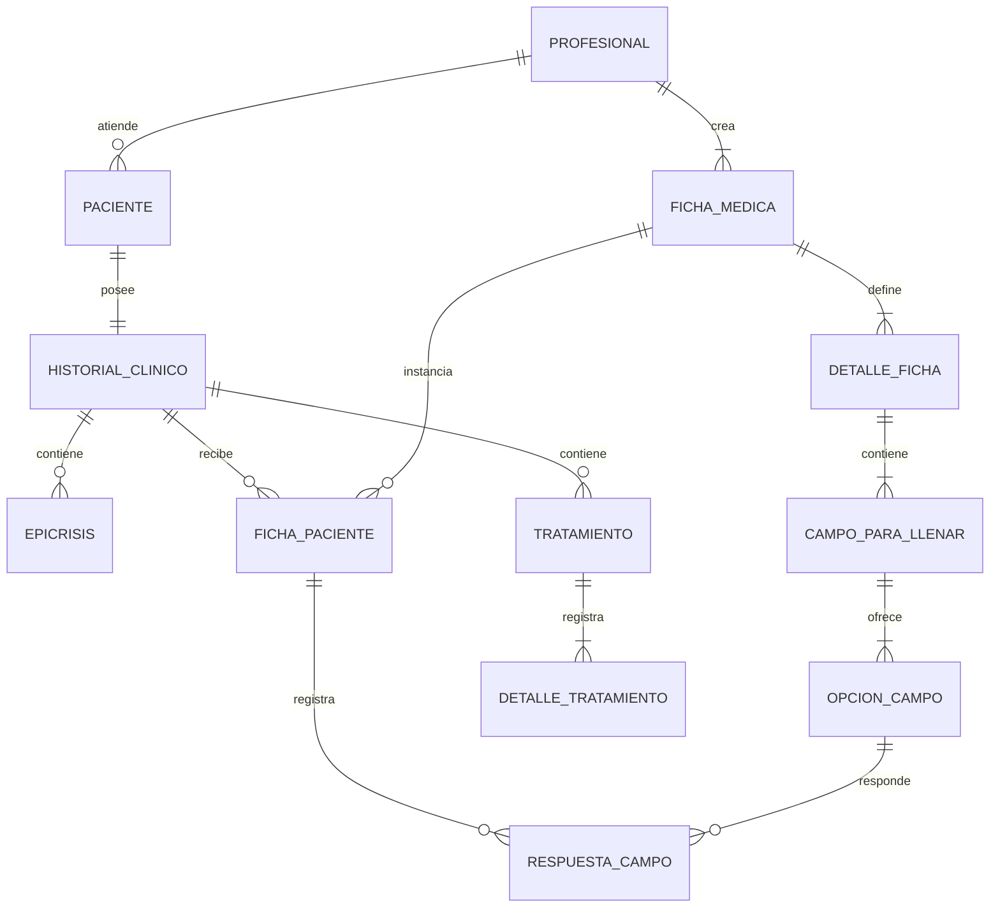

# Servicio de historiales clínicos

Sistema para administrar pacientes y sus historias clínicas. El alcance funcional se concentra exclusivamente en pacientes, epicrisis, fichas médicas y tratamientos. No incluye autenticación, permisos ni administración de profesionales.

> **Importante:** la ausencia de autenticación es una decisión de alcance para esta etapa. El sistema no debe publicarse ni utilizar datos clínicos reales en estas condiciones.

## Estado del proyecto

El microservicio y el frontend ya cuentan con el primer módulo funcional: CRUD de plantillas de ficha médica. Eureka y Gateway todavía no fueron generados.

## Arquitectura prevista

```text
React (JavaScript + JSX, Vite)
               |
               | HTTP/REST + JSON
               v
      Spring Cloud Gateway
               |
               | descubrimiento de servicio
               v
  clinical-history-service <----> PostgreSQL
               |
               v
          Eureka Server
```

- `frontend`: interfaz web construida con React, JavaScript, JSX y Vite.
- `api-gateway`: único punto de entrada previsto para el frontend.
- `eureka-server`: registro y descubrimiento de servicios.
- `clinical-history-service`: microservicio que contiene toda la lógica de negocio.
- PostgreSQL: persistencia relacional del dominio clínico.
- Docker Compose: ejecución coordinada del sistema completo.

## Estructura del repositorio

```text
Servicio-historiales-clinicos/
|-- api-gateway/
|-- clinical-history-service/
|-- docs/
|-- eureka-server/
|-- frontend/
|-- .env.example
|-- .gitignore
|-- compose.yaml
`-- README.md
```

Los directorios contienen inicialmente archivos `.gitkeep` y se completarán cuando se genere cada proyecto.

## Tecnologías acordadas

### Backend e infraestructura

- Java 21
- Spring Boot 3.5.x
- Maven
- Spring Web
- Spring Data JPA
- Bean Validation
- Spring Cloud Gateway
- Spring Cloud Netflix Eureka
- PostgreSQL
- Flyway
- OpenAPI/Swagger
- Docker y Docker Compose

### Frontend

- React
- JavaScript
- JSX
- Vite como servidor de desarrollo y herramienta de compilación

El frontend incluye actualmente:

- Página principal con acceso a los módulos previstos.
- Módulo de fichas médicas habilitado.
- Selección temporal del profesional mediante su identificador.
- Listado de plantillas del profesional.
- Creación y edición de detalles, campos y opciones anidadas.
- Eliminación de plantillas con confirmación.
- Visualización de errores devueltos por el backend.
- Diseño adaptable a escritorio y dispositivos móviles.

Durante el desarrollo, Vite redirige las solicitudes `/api` hacia `http://localhost:8080`. Esto permite probar el microservicio directamente hasta incorporar el API Gateway.

## Modelo de dominio propuesto

El modelo inicial fue aportado mediante un diagrama y queda sujeto a refinamiento durante la implementación.



### Paciente

Representa a la persona cuya información clínica administra el sistema.

| Campo | Tipo propuesto |
|---|---|
| `id_paciente` | entero |
| `id_profesional` | entero; referencia externa |
| `nombre` | texto |
| `apellido` | texto |
| `email` | texto |
| `dni` | texto |
| `telefono` | texto |
| `fechaNacimiento` | fecha |
| `sexo` | texto |

### HistorialClinico

Agrupa toda la información clínica perteneciente a un paciente.

| Campo | Tipo propuesto |
|---|---|
| `id_historialClinico` | entero |
| `id_paciente` | entero |
| `campos_a_llenar` | pendiente de definición |

### Epicrisis

Registra una síntesis clínica asociada al historial.

| Campo | Tipo propuesto |
|---|---|
| `id_epicrisis` | entero |
| `fecha_hora` | fecha y hora |
| `observaciones` | texto |

### FichaMedica

Representa una **plantilla configurable** creada por un profesional. Un profesional debe tener entre una y cinco fichas médicas. Una misma plantilla puede asignarse a distintos pacientes sin compartir entre ellos las respuestas cargadas.

| Campo | Tipo propuesto |
|---|---|
| `id_ficha_medica` | entero |
| `id_profesional` | entero; referencia externa |
| `nombre_ficha` | texto |
| `fecha_hora_creacion` | fecha y hora |
| `observaciones` | texto |

### DetalleFicha

Define una sección perteneciente a la plantilla, por ejemplo `Antecedentes personales no patológicos`.

| Campo | Tipo propuesto |
|---|---|
| `titulo` | texto |
| `descripcion` | texto opcional |
| `orden` | entero |

### CampoParaLlenar

Define una pregunta o concepto que deberá completarse dentro del detalle, por ejemplo `Tabaquismo`. Debe contener una o más opciones.

| Campo | Tipo propuesto |
|---|---|
| `titulo` | texto |
| `descripcion` | texto opcional |
| `orden` | entero |

### OpcionCampo

Define una alternativa seleccionable o un dato que se completa por teclado. Cada `CampoParaLlenar` debe contener entre una y muchas opciones.

| Campo | Tipo propuesto |
|---|---|
| `titulo` | texto |
| `tipo` | `SELECCION` o `ENTRADA` |
| `descripcion` | texto opcional |
| `orden` | entero |
| `grupo_exclusion` | texto opcional |

El `grupo_exclusion` permite indicar que varias opciones son disyuntivas. Si el profesional selecciona una opción del grupo, las demás quedan desmarcadas.

### FichaPaciente

Representa la asignación de una plantilla de ficha médica al historial clínico de un paciente. Su existencia separa la definición reutilizable de la información clínica efectivamente completada.

### RespuestaCampo

Conserva la respuesta correspondiente a una `OpcionCampo` dentro de una `FichaPaciente`. Según el tipo de opción, registra una selección o un valor ingresado por teclado. Las respuestas pertenecen exclusivamente al paciente al que se asignó la ficha.

## Lógica de construcción y uso de fichas médicas

### Creación de la plantilla

1. El profesional crea una ficha médica y define su nombre.
2. Agrega una o más secciones representadas por `DetalleFicha`.
3. Dentro de cada sección agrega uno o más `CampoParaLlenar`.
4. Dentro de cada campo agrega obligatoriamente una o más `OpcionCampo`.
5. Las opciones se ordenan para determinar cómo se mostrarán en el frontend.
6. El profesional puede crear como mínimo una y como máximo cinco plantillas de ficha médica.

### Asignación y carga

1. Se selecciona una plantilla perteneciente al mismo profesional que tiene asociado el paciente.
2. La plantilla se asigna al historial clínico y genera una `FichaPaciente`.
3. El profesional completa o selecciona las opciones correspondientes.
4. Las respuestas se guardan en la ficha del paciente y no modifican la plantilla.
5. Una misma plantilla puede utilizarse con muchos pacientes, manteniendo respuestas independientes.

### Ejemplo

```text
Antecedentes personales no patológicos     DetalleFicha
`-- Tabaquismo                             CampoParaLlenar
    |-- Sí                                 OpcionCampo: SELECCION
    |-- No                                 OpcionCampo: SELECCION
    `-- ¿Cuántos por día?                  OpcionCampo: ENTRADA
```

Las opciones `Sí` y `No` pertenecen al mismo grupo de exclusión, por lo que son disyuntivas. `¿Cuántos por día?` permite ingresar un valor por teclado. La futura implementación podrá condicionar la habilitación de esta última opción a que se seleccione `Sí`.

### Reglas de negocio confirmadas

- Cada profesional tiene entre una y cinco plantillas de ficha médica.
- Cada plantilla pertenece a un único profesional.
- Cada plantilla contiene uno o más detalles.
- Cada detalle contiene uno o más campos para llenar.
- Cada campo para llenar contiene obligatoriamente una o más opciones.
- Una opción puede ser seleccionable o permitir entrada por teclado.
- Las opciones seleccionables pueden agruparse para comportarse de forma disyuntiva.
- Asignar una plantilla a un paciente no altera la plantilla original.
- Las respuestas de pacientes diferentes nunca se comparten.

### Tratamiento

Registra un tratamiento asociado al historial clínico.

| Campo | Tipo propuesto |
|---|---|
| `id_tratamiento` | entero |
| `nombre` | texto |
| `descripcion` | texto |
| `cantidadDeSesionesTotal` | entero |
| `cantidadDeSesionesFaltantes` | entero |

### DetalleTratamiento

Registra las sesiones o avances de un tratamiento.

| Campo | Tipo propuesto |
|---|---|
| `id_tratamiento` | entero |
| `nroSesion` | entero |
| `observaciones` | texto |
| `fechaHora` | fecha y hora |

## Relaciones interpretadas

- Un profesional puede tener asociados cero o más pacientes.
- Cada paciente pertenece a un profesional, identificado mediante `id_profesional`.
- Un paciente posee un historial clínico.
- Un historial clínico puede contener cero o más epicrisis.
- Un profesional crea entre una y cinco plantillas de ficha médica.
- Un historial clínico puede recibir cero o más fichas basadas en esas plantillas.
- Un historial clínico puede contener cero o más tratamientos.
- Una plantilla de ficha médica contiene uno o más detalles.
- Un detalle de ficha contiene uno o más campos para llenar.
- Un campo para llenar contiene una o más opciones.
- Un tratamiento contiene uno o más detalles o sesiones.

## Decisiones pendientes del dominio

- Determinar si los identificadores serán enteros o UUID.
- Definir el mecanismo futuro para validar `id_profesional`; por ahora se conservará en `Paciente` como referencia externa simple porque este sistema no administra profesionales.
- Aclarar el propósito de `campos_a_llenar` en `HistorialClinico`.
- Definir los identificadores de `DetalleFicha`, `CampoParaLlenar`, `OpcionCampo`, `FichaPaciente` y `RespuestaCampo`.
- Precisar cómo se representarán los valores de entrada, inicialmente texto, y si se agregarán tipos como número o fecha.
- Definir si una opción de entrada puede depender formalmente de otra opción, como `¿Cuántos por día?` respecto de `Sí`.
- Definir qué ocurre con las fichas ya asignadas cuando el profesional modifica su plantilla.
- Confirmar si una ficha médica se relaciona directamente con una epicrisis o únicamente con el historial clínico.
- Definir reglas de edición, anulación y conservación de los registros clínicos.
- Confirmar si `cantidadDeSesionesFaltantes` se persiste o se calcula a partir de las sesiones registradas.
- Normalizar nombres al implementar: clases en singular, atributos Java en `camelCase` y columnas SQL en `snake_case`.

## Convenciones iniciales

- API versionada bajo `/api/v1`.
- Intercambio de información mediante JSON.
- Fechas y horas de backend almacenadas en UTC.
- DTOs separados de las entidades de persistencia.
- Migraciones de base de datos administradas con Flyway.
- Ninguna eliminación física de información clínica hasta definir formalmente las reglas de conservación.
- El frontend se comunicará con el API Gateway y no directamente con el microservicio.

### División de responsabilidades del backend

Cada módulo funcional se organiza con los siguientes paquetes:

```text
fichamedica/
|-- controlador/  endpoints REST; en el futuro extraerá la identidad del JWT
|-- servicio/     lógica de negocio, mapeo y límites transaccionales
|-- repositorio/  acceso a PostgreSQL mediante Spring Data JPA
|-- modelo/       entidades y enumeraciones persistentes
`-- dto/         cuerpos de entrada y salida de la API

excepcion/       errores de negocio y tratamiento centralizado
```

La autenticación todavía está fuera del alcance. Por eso los controladores reciben temporalmente `idProfesional` en la ruta. Cuando se incorpore JWT, el identificador del profesional deberá obtenerse de sus claims y no confiarse al cuerpo de la solicitud.

## API de plantillas de ficha médica

El profesional se representa mediante un identificador externo incluido en la URL. Crear o actualizar una ficha procesa el agregado completo: plantilla, detalles, campos y opciones.

| Método | Ruta | Operación |
|---|---|---|
| `POST` | `/api/v1/profesionales/{idProfesional}/fichas-medicas` | Crear una plantilla |
| `GET` | `/api/v1/profesionales/{idProfesional}/fichas-medicas` | Listar las plantillas del profesional |
| `GET` | `/api/v1/profesionales/{idProfesional}/fichas-medicas/{idFicha}` | Consultar una plantilla |
| `PUT` | `/api/v1/profesionales/{idProfesional}/fichas-medicas/{idFicha}` | Reemplazar una plantilla completa |
| `DELETE` | `/api/v1/profesionales/{idProfesional}/fichas-medicas/{idFicha}` | Eliminar una plantilla |

Ejemplo de creación:

```json
{
  "nombre": "Historia clínica general",
  "descripcion": "Plantilla inicial",
  "detalles": [
    {
      "titulo": "Antecedentes personales no patológicos",
      "orden": 0,
      "campos": [
        {
          "titulo": "Tabaquismo",
          "orden": 0,
          "permiteSeleccionMultiple": false,
          "opciones": [
            {
              "titulo": "Sí",
              "tipo": "SELECCION",
              "orden": 0,
              "grupoExclusion": "smoking"
            },
            {
              "titulo": "No",
              "tipo": "SELECCION",
              "orden": 1,
              "grupoExclusion": "smoking"
            },
            {
              "titulo": "¿Cuántos por día?",
              "tipo": "ENTRADA",
              "orden": 2
            }
          ]
        }
      ]
    }
  ]
}
```

Reglas aplicadas por el backend:

- Máximo de cinco fichas por profesional.
- Toda ficha requiere al menos un detalle.
- Todo detalle requiere al menos un campo.
- Todo campo requiere al menos una opción.
- El título es obligatorio, salvo para una opción `SI_NO` o cuando el campo contiene una única opción `ENTRADA`.
- Cada campo define mediante `permiteSeleccionMultiple` si admite elegir varias opciones simultáneamente; su valor predeterminado es `false`.
- Cuando `permiteSeleccionMultiple` es `false`, las opciones de tipo `SELECCION` se comportarán como una selección única.
- Cuando es `true`, podrán marcarse varias opciones, excepto aquellas que compartan el mismo `grupoExclusion`.
- `permiteSeleccionMultiple` solo afecta opciones `SELECCION`; no modifica opciones `ENTRADA` ni `SI_NO`.
- `grupoExclusion` solo se aplica a opciones `SELECCION`; no tiene efecto en opciones `ENTRADA`.
- Los tipos admitidos son `SELECCION`, `ENTRADA` y `SI_NO`.
- `SI_NO` genera directamente las respuestas Sí y No y no requiere crearlas manualmente. Cada campo admite como máximo una opción `SI_NO`, que puede convivir con opciones `SELECCION` y `ENTRADA`.
- Cuando un campo ya contiene `SI_NO`, el frontend deshabilita ese tipo en las demás opciones para impedir que se agregue por segunda vez.
- Una ficha solo puede consultarse, actualizarse o eliminarse desde el identificador de su profesional propietario.
- La actualización utiliza control de versión optimista en persistencia.

Swagger UI queda disponible en `http://localhost:8080/swagger-ui.html` cuando el microservicio está en ejecución.

## Próximos pasos

- [x] Crear la estructura inicial del repositorio.
- [x] Documentar el alcance y el modelo de dominio recibido.
- [ ] Resolver las decisiones pendientes del modelo.
- [ ] Generar Eureka Server.
- [ ] Generar API Gateway.
- [x] Generar el microservicio de historiales clínicos.
- [x] Implementar el CRUD de plantillas de ficha médica.
- [x] Crear el frontend React con Vite.
- [x] Implementar la interfaz CRUD de fichas médicas.
- [x] Incorporar PostgreSQL y Docker Compose.
- [x] Contenerizar el microservicio y el frontend.
- [ ] Implementar el primer flujo vertical del dominio.

## Ejecución

### Ejecución completa con Docker

El único requisito para ejecutar el sistema completo es Docker con Docker Compose. Desde la raíz del repositorio:

```bash
docker compose up --build -d
```

Compose construye las imágenes y levanta los servicios respetando este orden:

```text
PostgreSQL saludable
        ↓
Microservicio saludable y migraciones aplicadas
        ↓
Frontend disponible
```

Servicios expuestos:

- Frontend: `http://localhost:5173`
- Backend y Swagger: `http://localhost:8080/swagger-ui.html`
- Estado del backend: `http://localhost:8080/actuator/health`
- PostgreSQL: `localhost:5432`

Consultar el estado:

```bash
docker compose ps
```

Ver los registros:

```bash
docker compose logs -f
```

Detener el sistema sin eliminar los datos:

```bash
docker compose down
```

El volumen `postgres_data` conserva PostgreSQL entre reinicios. Para cambiar las credenciales se puede copiar `.env.example` como `.env` y ajustar sus valores antes de levantar los servicios.

### Desarrollo sin contenerizar

Java, Maven y Node.js solo son necesarios si se desea ejecutar o probar cada aplicación directamente durante el desarrollo.

Ejecutar las pruebas:

```bash
cd clinical-history-service
mvn test
```

Flyway crea y valida automáticamente las tablas. La configuración local predeterminada coincide con las credenciales de `.env.example` y puede reemplazarse mediante `DB_URL`, `DB_USER` y `DB_PASSWORD`.
